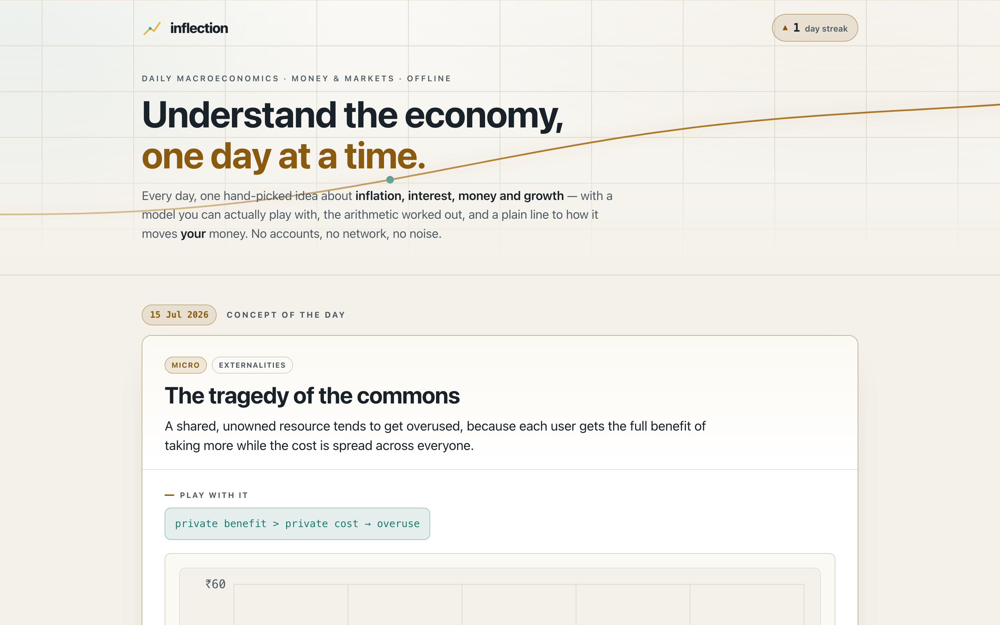

# inflection

**Understand the economy, one day at a time.** A daily macroeconomics sensei: each calendar day it surfaces one hand-authored concept — inflation, interest rates, the money supply, GDP, unemployment, exchange rates, and more — paired with an *interactive model you can actually play with*, a worked numeric example, and a plain-language bridge to how the idea moves your own money. 100% client-side, zero dependencies, works fully offline.

## Why

Most "learn economics" resources are either dry textbook walls or hot-take threads with no math. Neither builds intuition. inflection takes the opposite bet: **one idea a day, made tangible.** Every concept has a slider-driven model — drag the inflation rate and watch ₹100 decay; move the yield and watch a bond's price fall; change the reserve ratio and watch the money multiplier balloon — so the formula stops being abstract. Then it shows the arithmetic, and connects the idea to real life (often in an Indian context: the RBI's 4% target, home-loan EMIs, the rupee, UPI's network effects).

Macro and money are the spine — inflation, deflation, interest rates, central banking, money supply and the multiplier, GDP and growth, unemployment and the Phillips curve, business cycles, fiscal vs monetary policy, exchange rates, and public debt — with a set of adjacent gems from microeconomics, game theory, and behavioural economics so the corpus feels rich rather than narrow.

## Features

- **A concept of the day** — a deterministic, date-seeded pick surfaces the same concept for everyone on a given calendar date. Come back tomorrow for a new one.
- **Interactive teaching models** — eight hand-rolled widgets (no charting library), each with keyboard-operable range sliders and live text readouts: a purchasing-power eroder, compound/real-return plotter, rule-of-70 comparison, loan-amortization curve, bond-price-vs-yield curve, money-multiplier hyperbola, supply-and-demand equilibrium with shocks, and a Phillips-curve trade-off.
- **Worked examples** — every concept shows the formula and a correct, step-by-step numeric example.
- **Your turn** — a challenge question per concept with a revealable, worked answer.
- **Streak + learned tracker** — a daily-visit streak and a mark-as-learned set, kept only in your browser.
- **Browse the whole corpus** — filter by area, shuffle a random concept, or step prev/next through 60+ concepts.
- **100% offline** — no accounts, no network calls, no tracking, no ads.

## Quickstart

Just open `index.html` in any modern browser — no build step, no server, no install.

- **Local:** double-click `index.html`, or run a static server in the folder.
- **Hosted:** **[Open inflection live](https://sreenivas-sadhu-prabhakara.github.io/inflection/)**

Your streak and learned concepts are saved in your browser's local storage, so they persist between visits on the same device.

## Privacy

inflection is built to be genuinely private.

- A strict Content-Security-Policy sets `connect-src 'none'`: the app **cannot** make any network request even if it tried — no CDNs, no fonts, no analytics, no images from anywhere but itself.
- Everything is self-contained: all logic is in one local `app.js`, all styles in one local `styles.css`, using only the system font stack.
- All state lives in your browser's local storage. Nothing about you is ever transmitted or stored anywhere but your own device.
- Because there are no network dependencies, once the page has loaded it keeps working with **no internet at all**.

## Honesty

inflection is a **hand-authored, curated corpus** with a **deterministic daily selection** — it is *not* live AI, *not* a market-data feed, and *not* a forecasting tool. The concept shown on a given date is chosen by hashing the date, so it is the same for everyone that day, but the words and numbers were written by a person, not generated at runtime. The interactive models are **simplified teaching abstractions** (ceteris paribus, illustrative) meant to build intuition — they are not simulations of the real economy and not predictions.

## Disclaimer

inflection provides general educational information about economics for learning purposes only. It is **not** financial, investment, tax, accounting, or legal advice, and nothing in it is a recommendation to take (or not take) any financial action. The models are deliberately simplified and hold other factors constant; real economies are messier. This software is provided under the MIT License, "as is", without warranty of any kind; the author accepts no liability for any loss or damage arising from its use. Always consult a qualified professional before making money decisions.

## License

[MIT](./LICENSE) © 2026 Sreenivas Sadhu Prabhakara
